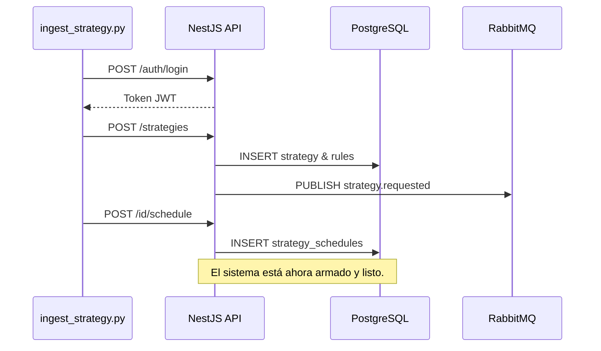

# Ciclo de Vida: Ingesta de Estrategias Automatizada

Este documento explica el viaje de los datos desde que ejecutas el script `ingest_strategy.py` hasta que impactan en la base de datos y activan los servicios de trading.

## 🔄 Flujo de Ejecución (Paso a Paso)

### 1. Fase de Autenticación
- **Acción**: El script envía el email y password al endpoint `POST /auth/login`.
- **Impacto DB**: Se genera (o renueva) un registro en la tabla `refresh_tokens`.
- **Resultado**: El script obtiene un **JWT (JSON Web Token)** necesario para las siguientes peticiones.

### 2. Identificación del Contexto
- **Acción**: El script consulta `GET /auth/me`.
- **Por qué**: Necesitamos el UUID real del usuario en la base de datos para "amarrar" la estrategia a su dueño.

### 3. Persistencia de la Estrategia (The Brain)
- **Acción**: Se envía el JSON completo a `POST /strategies`.
- **Impacto DB**:
    - **Tabla `strategies`**: Se inserta el nombre, descripción y el objeto `config`. Este objeto guarda el plan de activos de IOL y los balances (ej: 70/30).
    - **Tabla `strategy_rules`**: Si se envían reglas técnicas, se crean los vínculos aquí vinculando la estrategia con sus parámetros de riesgo.
    - **Tabla `event_logs`**: Se guarda un registro de tipo `strategy.created`.
- **Impacto Sistema**: La API publica un evento `strategy.requested` en RabbitMQ. Esto avisa a los microservicios externos que hay una nueva estrategia lista para ser auditada.

### 4. Activación del Cronograma (The Trigger)
- **Acción**: Se envía la configuración del cronograma a `POST /strategies/{id}/schedule`.
- **Impacto DB**: Se inserta en la tabla `strategy_schedules`.
- **Impacto Sistema**: El servicio interno `StrategySchedulerService` (que corre cada minuto) ahora detectará este registro. Cuando la fecha actual coincida con el cronograma (ej: el día 1 de cada mes), disparará una ejecución.

---

## 🏗️ Impacto Estructural en el Programa

Una vez que el script termina, la estrategia queda en estado **"Zombi Inteligente"**:
1.  **Está viva**: Porque el Scheduler la vigila.
2.  **Tiene memoria**: Porque su `config` tiene todos los tickers y montos.
3.  **Está sujeta a reglas**: Porque los microservicios de validación ahora tienen el contrato (Rules) para detenerla si algo sale mal.

### Visualización del Impacto:

