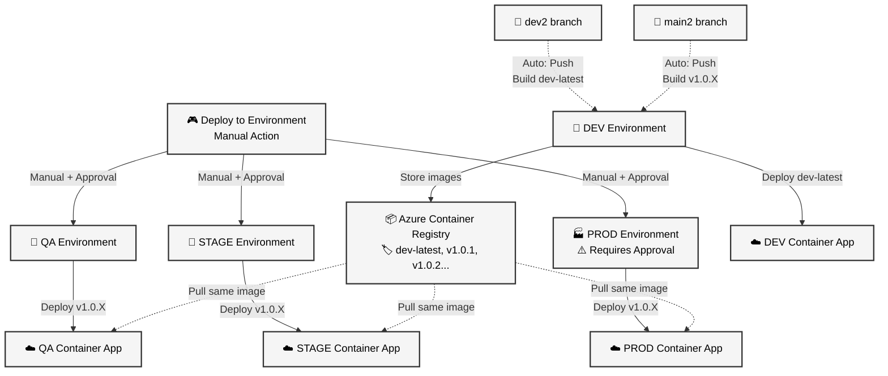

# GitHub Actions Setup - Verifeye Backend CI/CD

This guide explains how to set up GitHub Actions for automated deployment of the Verifeye backend to Azure Container Apps using **GitHub Environments**.

## 🎯 Workflow Overview

**3 Workflows for Complete CI/CD:**
1. **Build on Merge to Dev2** - Automatic DEV testing (uses `dev` environment)
2. **Build Release Version** - Automatic versioning from main2 (uses `dev` environment)
3. **Deploy to Environment** - Manual deployment to QA/STAGE/PROD (uses respective environments)

## ✅ Setup Checklist

### 📋 **Step 1: Create GitHub Environments**
Go to **Settings → Environments**

Create these 4 environments:
- **`dev`** - Development environment
- **`qa`** - QA environment  
- **`stage`** - Staging environment
- **`prod`** - Production environment

### 📋 **Step 2: Configure Environment Protection Rules**
For **Production environment** (`prod`):
1. Go to **Settings → Environments → prod**
2. Check **"Required reviewers"** 
3. Add yourself and team members
4. Optionally set **"Wait timer"** (e.g., 5 minutes)

For **Staging environment** (`stage`) - Optional:
1. Check **"Required reviewers"** for extra safety

### 📋 **Step 3: Configure Environment Variables**
For **each environment** (dev, qa, stage, prod):

Go to **Settings → Environments → [environment-name] → Add variable**

Configure these Azure resource names **per environment**:

#### For `dev` environment:
```
AZURE_RESOURCE_GROUP=your-existing-rg-dev
AZURE_CONTAINER_REGISTRY=yoursharedregistry
AZURE_KEY_VAULT=your-existing-kv-dev
AZURE_CONTAINER_ENV=your-existing-env-dev
AZURE_BLOB_STORAGE=yourexistingblobdev
```

#### For `qa` environment:
```
AZURE_RESOURCE_GROUP=your-existing-rg-qa
AZURE_CONTAINER_REGISTRY=yoursharedregistry
AZURE_KEY_VAULT=your-existing-kv-qa
AZURE_CONTAINER_ENV=your-existing-env-qa
AZURE_BLOB_STORAGE=yourexistingblobqa
```

#### For `stage` environment:
```
AZURE_RESOURCE_GROUP=your-existing-rg-stage
AZURE_CONTAINER_REGISTRY=yoursharedregistry
AZURE_KEY_VAULT=your-existing-kv-stage
AZURE_CONTAINER_ENV=your-existing-env-stage
AZURE_BLOB_STORAGE=yourexistingblobstage
```

#### For `prod` environment:
```
AZURE_RESOURCE_GROUP=your-existing-rg-prod
AZURE_CONTAINER_REGISTRY=yoursharedregistry
AZURE_KEY_VAULT=your-existing-kv-prod
AZURE_CONTAINER_ENV=your-existing-env-prod
AZURE_BLOB_STORAGE=yourexistingblobprod
```

> **Note**: `AZURE_CONTAINER_REGISTRY` is the same across all environments - all deployments pull from the same shared registry.

### 📋 **Step 4: Repository Secrets**
Go to **Settings → Secrets and variables → Actions → Secrets**

Create these **repository-level secrets** (shared across all environments):

```
AZURE_CREDENTIALS={
  "clientId": "xxxxxxxx-xxxx-xxxx-xxxx-xxxxxxxxxxxx",
  "clientSecret": "your-client-secret", 
  "subscriptionId": "xxxxxxxx-xxxx-xxxx-xxxx-xxxxxxxxxxxx",
  "tenantId": "xxxxxxxx-xxxx-xxxx-xxxx-xxxxxxxxxxxx"
}
```

### 📋 **Step 5: Azure RBAC Permissions**
**Using Azure Portal (your current method):**

1. **Subscription Level**:
   - Go to **Azure Portal → Subscriptions → Your Subscription → Access control (IAM)**
   - Add role assignment: **`Contributor`** for service principal `github-actions-verifeye`

2. **For each Container Registry**:
   - Go to **Container Registry → Access control (IAM)**
   - Add roles: **`AcrPush`** and **`AcrPull`**

3. **For each Key Vault**:
   - Go to **Key Vault → Access policies**
   - Add access policy with **`Get`**, **`List`**, **`Set`**, **`Delete`** secret permissions

### 📋 **Step 6: Environment Files**
Ensure these files exist and are committed:
```
TR-verify-api-develop/environments/.env.dev
TR-verify-api-develop/environments/.env.qa  
TR-verify-api-develop/environments/.env.stage
TR-verify-api-develop/environments/.env.prod
```

### 📋 **Step 7: Create Branches**
```bash
git checkout -b dev2
git checkout -b main2
git push origin dev2
git push origin main2
```

## 🚀 How to Use

### **Daily Development Flow:**

1. **Work on features in dev2**
   ```bash
   git checkout dev2
   # Make changes
   git commit -m "Add new feature"
   git push origin dev2
   ```
   → **Automatic**: Builds `dev-latest` and deploys to DEV environment

2. **Ready for release**
   ```bash
   # Create PR: dev2 → main2
   # Review and merge
   ```
   → **Automatic**: Builds versioned image (v1.0.1, v1.0.2, etc.) in DEV registry

3. **Deploy to production environments**
   - Go to **Actions → Deploy to Environment**
   - Select environment (QA/STAGE/PROD)
   - **Approval required for PROD** (if configured)
   - Optionally select version (uses latest if empty)
   - Click **Run workflow**

### **Version Management:**
- **Automatic**: PATCH increment (1.0.0 → 1.0.1 → 1.0.2)
- **Manual MINOR/MAJOR**: Create git tag manually when needed

## 🔄 Workflow Details

### 1. **Build on Merge to Dev2** (Automatic)
- **Trigger**: Push to `dev2` branch
- **Environment**: `dev`
- **Purpose**: Fast DEV testing
- **Output**: `dev-latest` image → DEV environment
- **Cost**: Minimal (overwrites same image)

### 2. **Build Release Version** (Automatic)
- **Trigger**: Push to `main2` branch  
- **Environment**: `dev` (stores builds in DEV registry)
- **Purpose**: Production-ready builds
- **Output**: Versioned image (v1.0.X) + Git tag
- **Versioning**: Automatic PATCH increment

### 3. **Deploy to Environment** (Manual)
- **Trigger**: Manual button click
- **Environment**: Dynamic (qa/stage/prod based on selection)
- **Protection**: Requires approval for PROD
- **Input**: Environment + optional version
- **Smart**: Shows available versions if none specified
- **Flow**: Pulls from DEV registry → Pushes to target environment registry

## 💡 Key Benefits

- ✅ **Environment Protection**: Approval required for production deployments
- ✅ **Automatic DEV testing** on every dev2 push
- ✅ **Automatic versioning** on main2 merge
- ✅ **Manual production control** with version selection
- ✅ **Cost effective** (dev-latest reuse)
- ✅ **Same image** promoted through all environments
- ✅ **Full traceability** with git tags and deployment records
- ✅ **Environment-specific variables** and settings

## 🔧 Troubleshooting

### **No workflows visible?**
- Workflows must be pushed to the default branch (main/master)
- Check that workflow files exist in `.github/workflows/`

### **Environment not found?**
- Ensure environments are created: Settings → Environments
- Check environment names match exactly: `dev`, `qa`, `stage`, `prod`

### **Variables not found?**
- Variables must be configured **per environment**
- Go to Settings → Environments → [env-name] → Variables
- Repository-level variables won't work with environments

### **Deployment waiting for approval?**
- Check if environment has required reviewers configured
- Approve the deployment in Actions tab
- Or remove required reviewers if not needed

### **Build fails on main2?**
- Ensure Dockerfile exists in `TR-verify-api-develop/`
- Check Azure credentials and permissions
- Verify DEV environment variables are configured

### **Deploy fails?**
- Check if target environment variables are configured
- Verify Container Apps exist and are accessible
- Ensure image version exists in DEV registry
- Check if source/target registries are accessible

## 📞 Quick Reference

| Task | Action | Environment Used |
|------|--------|------------------|
| Test feature | Push to `dev2` | `dev` |
| Release version | Merge `dev2` → `main2` | `dev` |
| Deploy to QA | Actions → Deploy → Select QA | `qa` |
| Deploy to STAGE | Actions → Deploy → Select STAGE | `stage` |
| Deploy to PROD | Actions → Deploy → Select PROD | `prod` (requires approval) |
| Check versions | Actions logs or `git tag -l` | - |
| Rollback | Deploy previous version | Target environment |

## 🏗️ Architecture



### **Key Points:**
- ✅ **Single Registry**: All environments use the same Azure Container Registry
- ✅ **Different Triggers**: 
  - `dev2` push → Builds `dev-latest` → Auto-deploys to DEV
  - `main2` push → Builds `v1.0.X` → Stores in registry (no auto-deploy)
- ✅ **Manual Production**: QA/STAGE/PROD require manual deployment
- ✅ **Environment Protection**: PROD requires manual approval
- ✅ **Cost Effective**: No image copying between registries